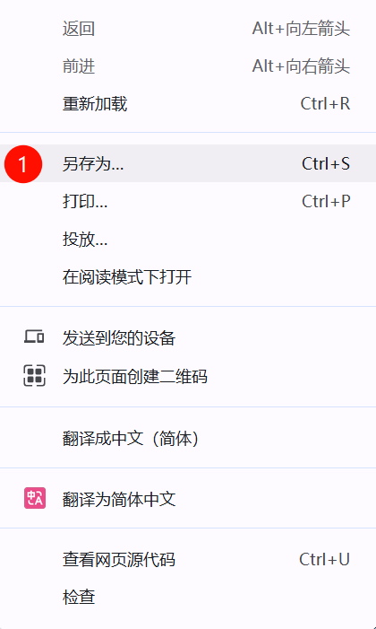

# 题目报告 PDF 生成器

本程序用于将 `paper_report.json` 转换为包含题干、选项、正确答案颜色标注和解析的 PDF。

## 使用步骤

1. 打开 cctalk 的“作业-查看报告”页面。  
2. 按照下图在开发者工具中找到 `paper_report?_timestamp=xxx` 的请求。  


3. 点击该请求并在新标签页中打开。  
4. 按照下图将内容另存为 `paper_report.json`，放到本项目目录。  


5. 安装依赖：

```bash
uv sync
```

6. 生成 PDF：

```bash
uv run python generate_pdf.py
```

输出文件为 `paper_report.pdf`。
